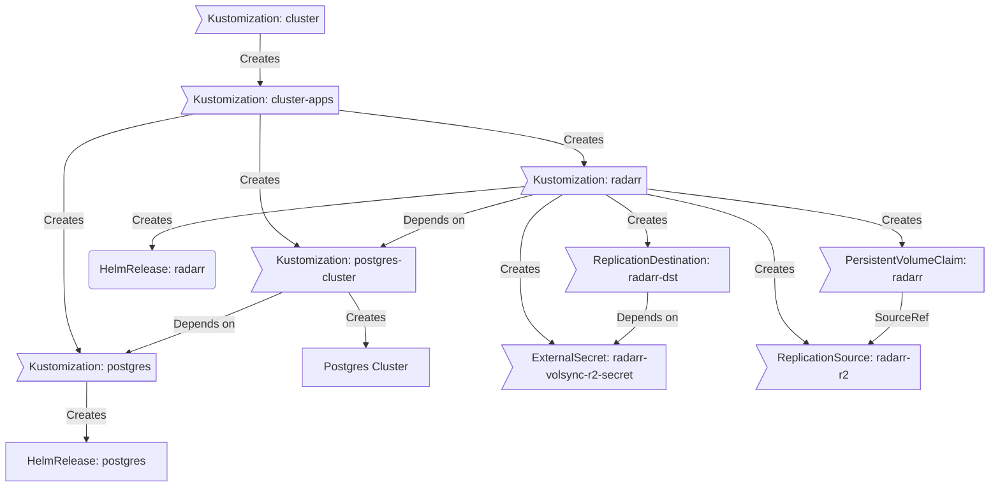

<div align="center">
  

### My Home Operations Repository :octocat:

_... managed with Flux, Renovate, and GitHub Actions_ 🤖

</div>

<div align="center">

&nbsp;&nbsp;
[](https://talos.dev)&nbsp;&nbsp;
[](https://kubernetes.io)&nbsp;&nbsp;

</div>

<div align="center">

[](https://status.56kbps.io)&nbsp;&nbsp;
[](https://status.56kbps.io)&nbsp;&nbsp;
[](https://status.56kbps.io)

</div>

<div align="center">

[](https://github.com/kashalls/kromgo)&nbsp;&nbsp;
[](https://github.com/kashalls/kromgo)&nbsp;&nbsp;
[](https://github.com/kashalls/kromgo)&nbsp;&nbsp;
[](https://github.com/kashalls/kromgo)&nbsp;&nbsp;
[](https://github.com/kashalls/kromgo)&nbsp;&nbsp;
[](https://github.com/kashalls/kromgo)&nbsp;&nbsp;
[](https://github.com/kashalls/kromgo)

</div>

---

## 📖 Overview

This is a repository for my home infrastructure and Kubernetes cluster. I try to adhere to Infrastructure as Code (IaC) and GitOps practices using tools like [Terraform](https://www.terraform.io/), [Kubernetes](https://kubernetes.io/), [Flux](https://github.com/fluxcd/flux2), [Renovate](https://github.com/renovatebot/renovate), and [GitHub Actions](https://github.com/features/actions).

---

## ⛵ Kubernetes

My Kubernetes cluster is deploy with [Talos](https://www.talos.dev). This is a cluster of workloads running on Intel NUC devices with all storage with NFS and ISCSI shared mounted via a Synology Rackstation appliance. I also utilize offsite backups to cloudflare r2 blob storage and take hourly snapshots using [Volsync].

There is a template over at [onedr0p/cluster-template](https://github.com/onedr0p/cluster-template) if you want to try and follow along with some of the practices I use here.

### Core Components

- [cert-manager](https://github.com/cert-manager/cert-manager): Creates SSL certificates for services in my cluster.
- [cilium](https://github.com/cilium/cilium): Internal Kubernetes container networking interface.
- [cloudflared](https://github.com/cloudflare/cloudflared): Enables Cloudflare secure access to certain ingresses.
- [external-dns](https://github.com/kubernetes-sigs/external-dns): Automatically syncs ingress DNS records to a DNS provider.
- [external-secrets](https://github.com/external-secrets/external-secrets): Managed Kubernetes secrets using [1Password Connect](https://github.com/1Password/connect).
- [ingress-nginx](https://github.com/kubernetes/ingress-nginx): Kubernetes ingress controller using NGINX as a reverse proxy and load balancer.
- [sops](https://github.com/getsops/sops): Managed secrets for Kubernetes and Terraform which are commited to Git.
- [spegel](https://github.com/spegel-org/spegel): Stateless cluster local OCI registry mirror.
- [volsync](https://github.com/backube/volsync): Backup and recovery of persistent volume claims.

### GitOps

[Flux](https://github.com/fluxcd/flux2) watches the clusters in my [kubernetes](./kubernetes/) folder (see Directories below) and makes the changes to my clusters based on the state of my Git repository.

The way Flux works for me here is it will recursively search the `kubernetes/apps` folder until it finds the most top level `kustomization.yaml` per directory and then apply all the resources listed in it. That aforementioned `kustomization.yaml` will generally only have a namespace resource and one or many Flux kustomizations (`ks.yaml`). Under the control of those Flux kustomizations there will be a `HelmRelease` or other resources related to the application which will be applied.

[Renovate](https://github.com/renovatebot/renovate) watches my **entire** repository looking for dependency updates, when they are found a PR is automatically created. When some (minor/patch) PRs are merged Flux applies the changes to my cluster.

### Directories

This Git repository contains the following directories under [Kubernetes](./kubernetes/).

```sh
📁 kubernetes
├── 📁 apps           # applications
├── 📁 bootstrap      # bootstrap procedures
├── 📁 flux           # core flux configuration
└── 📁 templates      # re-useable components
```

### Flux Workflow

This is a high-level look how Flux deploys my applications with dependencies. Below there are 3 Flux kustomizations `postgres`, `postgres-cluster`, and `atuin`. `postgres` is the first app that needs to be running and healthy before `postgres-cluster` and once `postgres-cluster` is healthy `atuin` will be deployed.



### Networking

<details>
  <summary>Click here to see my high-level network diagram</summary>

  
</details>

---

## ☁️ Cloud Dependencies

While most of my infrastructure and workloads are self-hosted I do rely upon the cloud for certain key parts of my setup. This saves me from having to worry about three things. (1) Dealing with chicken/egg scenarios, (2) services I critically need whether my cluster is online or not and (3) The "hit by a bus factor" - what happens to critical apps (e.g. Email, Password Manager, Photos) that my family relies on when I no longer around.

Alternative solutions to the first two of these problems would be to host a Kubernetes cluster in the cloud and deploy applications like [HCVault](https://www.vaultproject.io/), [Vaultwarden](https://github.com/dani-garcia/vaultwarden), [ntfy](https://ntfy.sh/), and [Gatus](https://gatus.io/); however, maintaining another cluster and monitoring another group of workloads would be more work and probably be more or equal out to the same costs as described below.

| Service                                         | Use                                                               | Cost           |
|-------------------------------------------------|-------------------------------------------------------------------|----------------|
| [1Password](https://1password.com/)             | Secrets with [External Secrets](https://external-secrets.io/)     | ~$65/yr        |
| [Cloudflare](https://www.cloudflare.com/)       | Domain and S3                                                     | ~$30/yr        |
| [GitHub](https://github.com/)                   | Hosting this repository and continuous integration/deployments    | Free           |
| [Fastmail](https://fastmail.com/)                   | Email hosting                                                     | ~$20/yr        |
| [Pushover](https://pushover.net/)               | Kubernetes Alerts and application notifications                   | $5 OTP         |
| [UptimeRobot](https://uptimerobot.com/)         | Monitoring internet connectivity and external facing applications | ~$58/yr        |
|                                                 |                                                                   | Total: ~$20/mo |

---

## 🌐 DNS

In my cluster there are two [ExternalDNS](https://github.com/kubernetes-sigs/external-dns) instances deployed. One is deployed with the [ExternalDNS webhook provider for UniFi](https://github.com/kashalls/external-dns-unifi-webhook) which syncs DNS records to my UniFi router. The other ExternalDNS instance syncs DNS records to Cloudflare only when the ingresses and services have an ingress class name of `external` and contain an ingress annotation `external-dns.alpha.kubernetes.io/target`. All local clients on my network use my UniFi router as the upstream DNS server.

---

## 🔧 Hardware

<details>
  <summary>Click here to see my server rack</summary>

  
</details>

| Device                      | Count | OS Disk Size | Data Disk Size               | Ram  | Operating System | Purpose                  |
|-----------------------------|-------|--------------|------------------------------|------|------------------|--------------------------|
| Intel NUC7i5BEH             | 3     | 512GB NVMe   |                              | 32GB | Talos            | Kubernetes Controllers   |
| Intel NUC7i5BEH             | 3     | 512GB NVMe   |                              | 32GB | Talos            | Kubernetes Controllers   |
| Intel NUC9i7BEH             | 1     | 512GB NVMe   |                              | 64GB | Talos            | Kubernetes Workers       |
| Synology RS2423RP+          | 1     | 2TB SSD      | 8x6TB HDD                    | 32GB | DSM 7.x          | NFS + ISCSI              |
| Synology DS1511+            | 1     | 2TB SSD      | 8x4TB HDD                    | 16GB | DSM 6.x          | NFS + Backup             |
| UniFi UDMP                  | 1     | -            | 1x8TB HDD                    | -    | -                | Router & NVR             |
| USW Pro 48 PoE              | 1     | -            | -                            | -    | -                | 10Gb PoE Switch          |
| USW Flex                    | 3     | -            | -                            | -    | -                | Distributed PoE Switches |
| CyberPower PDU41001         | 1     | -            | -                            | -    | -                | Server Remote PDU        |
| APC SMT1500RM2U             | 1     | -            | -                            | -    | -                | UPS                      |

---

## ⭐ Stargazers

<div align="center">

[](https://star-history.com/#sob/home-ops&Date)

</div>

---

## 🤝 Gratitude and Thanks

Thanks to all the people who donate their time to the [Home Operations](https://discord.gg/home-operations) Discord community. A special thanks to [onedr0p](https://github.com/onedr0p) for the inspiration, templates, and support. Be sure to check out [kubesearch.dev](https://kubesearch.dev/) for ideas on how to deploy applications or get ideas on what you could deploy.
